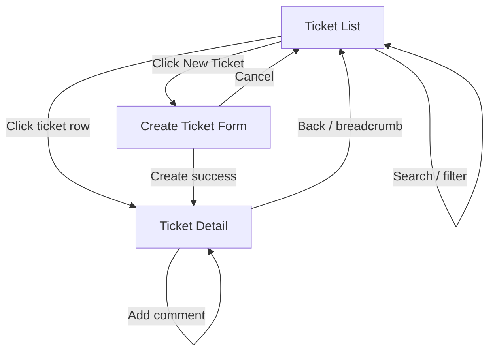

# UI Flow

## Application Map

```
┌──────────────────────────────────────────────────────────────┐
│                     Support Ticket UI                         │
├──────────────────────────────────────────────────────────────┤
│  Header: "Support Tickets"          [+ New Ticket] button     │
├──────────────────────────────────────────────────────────────┤
│                                                               │
│  Route: /                                                     │
│  ┌─────────────────────────────────────────────────────────┐ │
│  │ Ticket List Page                                         │ │
│  │  [Search input]  [Status filter dropdown]  [Search btn]│ │
│  │  ┌─────────────────────────────────────────────────────┐│ │
│  │  │ Ticket rows (title, status, priority, assignee, date) ││ │
│  │  │ Click row → /tickets/:id                             ││ │
│  │  └─────────────────────────────────────────────────────┘│ │
│  │  Loading spinner | Empty state | Error alert           │ │
│  └─────────────────────────────────────────────────────────┘ │
│                                                               │
│  Route: /tickets/new                                          │
│  ┌─────────────────────────────────────────────────────────┐ │
│  │ Create Ticket Page                                       │ │
│  │  Title, Description, Priority, Created By, Assigned To   │ │
│  │  [Cancel] [Create]                                       │ │
│  │  Inline validation + API errors                            │ │
│  └─────────────────────────────────────────────────────────┘ │
│                                                               │
│  Route: /tickets/:id                                          │
│  ┌─────────────────────────────────────────────────────────┐ │
│  │ Ticket Detail Page                                       │ │
│  │  View mode / Edit mode for title, desc, priority, assign │ │
│  │  Status section: current status + transition dropdown    │ │
│  │  [Change Status]                                         │ │
│  │  Comments list + Add Comment form                        │ │
│  └─────────────────────────────────────────────────────────┘ │
└──────────────────────────────────────────────────────────────┘
```

---

## Page Flows

### 1. Ticket List (`/`)

**Entry:** App load or navigation from other pages.

**UI elements:**
- Search text input (keyword)
- Status filter dropdown: All | Open | In Progress | Resolved | Closed | Cancelled
- "Search" / "Apply" button (or debounced auto-search on change)
- "New Ticket" button → `/tickets/new`
- Ticket table/list: Title, Status (badge), Priority, Assignee, Updated date
- Row click → `/tickets/{id}`

**API calls:**
- `GET /api/tickets?search={q}&status={status}`

**States:**
| State | UI |
|-------|-----|
| Loading | Spinner/skeleton |
| Success (data) | Ticket list |
| Success (empty) | "No tickets found" empty state |
| Error | Error alert with API message |

---

### 2. Create Ticket (`/tickets/new`)

**Entry:** Click "New Ticket" from list.

**Form fields:**
| Field | Control | Required |
|-------|---------|----------|
| Title | Text input | Yes |
| Description | Textarea | Yes |
| Priority | Select: Low/Medium/High | Yes |
| Created By | User dropdown | Yes |
| Assigned To | User dropdown | Yes |

**Actions:**
- Cancel → back to `/`
- Create → `POST /api/tickets` → redirect to `/tickets/{id}` on success

**Validation:**
- Client-side: required field checks before submit
- Server-side: display field errors from 400 response

**API calls:**
- `GET /api/users` (on mount, populate dropdowns)
- `POST /api/tickets`

---

### 3. Ticket Detail (`/tickets/:id`)

**Entry:** Click ticket from list or redirect after create.

**Sections:**

#### A. Ticket Information
- Display: Title, Description, Priority, Status, Created By, Assigned To, Created/Updated timestamps
- Edit mode: inline form or "Edit" toggle for title, description, priority, assignee
- Save → `PUT /api/tickets/{id}`

#### B. Status Transition
- Show current status prominently
- Dropdown populated with `validNextStatuses` from detail response
- If terminal (Closed/Cancelled): no dropdown; message "No further transitions available"
- "Change Status" button → `POST /api/tickets/{id}/status`
- On invalid transition (shouldn't happen if UI limited, but API is authoritative): show error alert

#### C. Comments
- List existing comments (author, message, timestamp)
- Add comment form: Message (textarea), Created By (dropdown)
- Submit → `POST /api/tickets/{ticketId}/comments` → refresh comments

**API calls:**
- `GET /api/tickets/{id}` (on mount and after mutations)
- `GET /api/users` (for dropdowns)
- `PUT /api/tickets/{id}` (update)
- `POST /api/tickets/{id}/status` (status change)
- `POST /api/tickets/{id}/comments` (add comment)

**States:**
| State | UI |
|-------|-----|
| Loading | Full-page or section spinner |
| Not found (404) | "Ticket not found" with link to list |
| Error | Error alert |
| Success | Populated detail view |

---

## User Interaction Diagram



---

## Status Transition UI Behavior

| Current Status | Dropdown options shown |
|----------------|------------------------|
| Open | In Progress, Cancelled |
| In Progress | Resolved, Cancelled |
| Resolved | Closed |
| Closed | (disabled — terminal) |
| Cancelled | (disabled — terminal) |

**Important:** Options derived from API `validNextStatuses` when available. If user somehow submits invalid transition, display backend error message verbatim.

---

## Error Handling UX

| Scenario | UI behavior |
|----------|-------------|
| Network failure | "Unable to connect to API" banner |
| 400 validation | Field-level or form-level error list |
| 400 invalid transition | Alert: show `detail` from ProblemDetails |
| 404 | Dedicated not-found message |
| 500 | Generic "Something went wrong" + optional detail in dev |

---

## Component Reuse

| Component | Used on |
|-----------|---------|
| `UserSelect` | Create, Detail (edit), Comment form |
| `ErrorAlert` | All pages |
| `LoadingSpinner` | All pages |
| `EmptyState` | List page |
| `StatusBadge` | List, Detail |
| `PrioritySelect` | Create, Detail edit |

---

## Routing Library

**React Router v6** — standard choice for Vite React apps.

Routes:
```tsx
<Routes>
  <Route path="/" element={<TicketListPage />} />
  <Route path="/tickets/new" element={<CreateTicketPage />} />
  <Route path="/tickets/:id" element={<TicketDetailPage />} />
</Routes>
```

---

## Styling Approach

- Minimal custom CSS or lightweight utility classes
- Focus on readability: clear labels, form spacing, status color badges
- No design system investment — functional over polished

---

## Dev Configuration

- Vite proxy: `/api` → `http://localhost:{apiPort}`
- Environment variable: `VITE_API_BASE_URL` (optional override)

---

## Accessibility (basic)

- Form labels associated with inputs
- Button disabled state during submit
- Error messages associated with fields where practical
